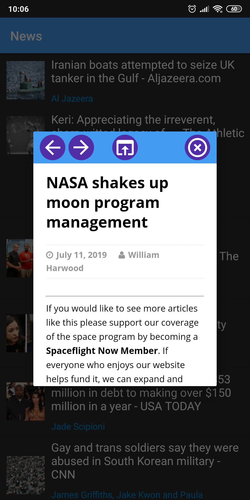

# Simple News App

  

## Description

This a simple news android app using google news api for get top headlines news. This portfolio project was created to show how easy it is to work with Kotlin and Google Api.

  

In app you can use quick view for fast open url in dialog webview. Then you can open the url in a regular browser if you need it.

  

### Dependencies

* [Google news Api](https://newsapi.org/s/google-news-api) 
for get news

* [Picasso Librarry](https://github.com/square/picasso) 
for easy set img from url

* [Okhttp3](https://github.com/square/okhttp/tree/master/okhttp/src/main/java/okhttp3) 

### Test App
* [Download APK](https://github.com/infinitum1984/SimpleNewsAndroidApp/blob/master/app/src/main/assets/Simple%20News%20App.apk) 

## Tymur Saparov

Email: tymur.saparov1@gmail.com

## Acknowledgments

* [Google News API](https://newsapi.org/s/google-news-api)

